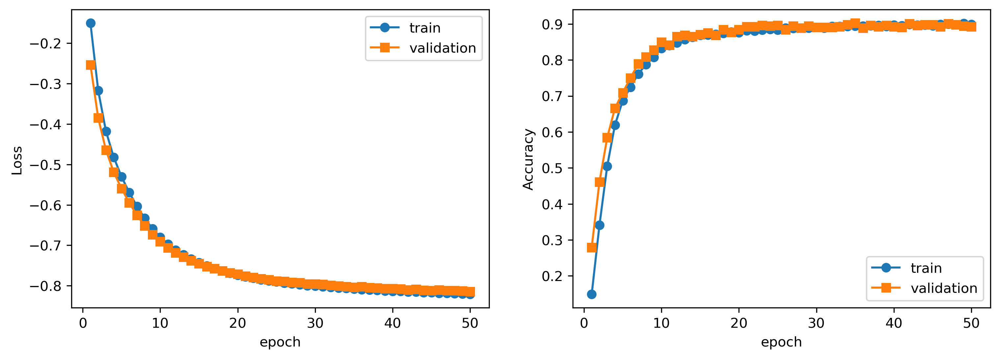
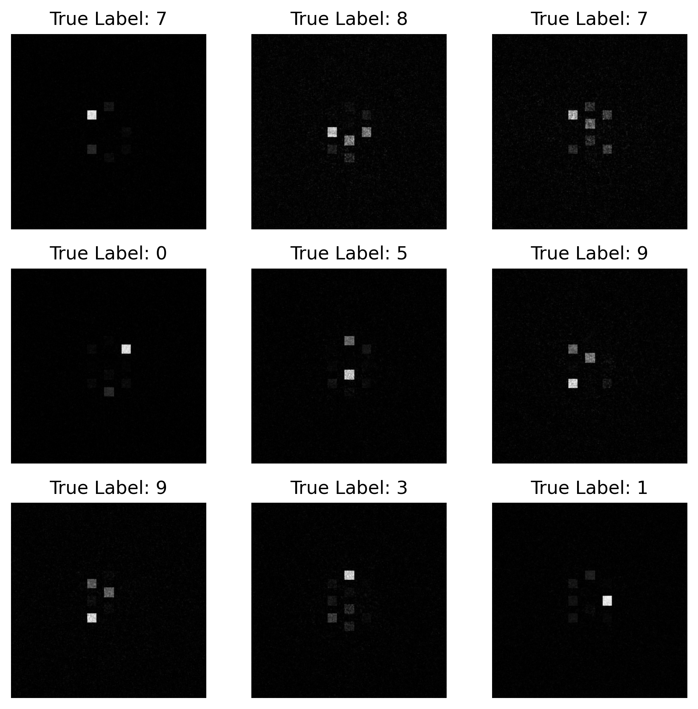
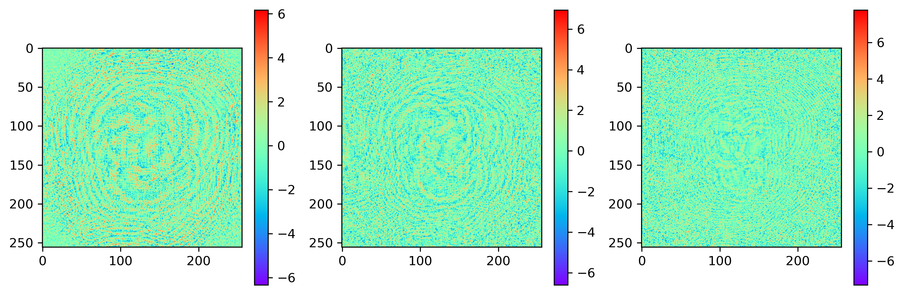

# Diffractive Deep Neural Network (D${}^2$NN)
## Get Started
OpticalLayer.py includes two types of Layers.  Diffraction is the free space propagtion layer and DiffLayer provides phase modulation. 

```python
from torch import nn
from OpticalLayers import DiffLayer,  Diffraction
```

Build your own model like you do in PyTorch. See model.py for details. 
```python


class Onn(nn.Module):
    def __init__(self, M, L, lambda0, z):
        super(Onn, self).__init__()

        # free space propagation
        self.layer0 = Diffraction(M, L, lambda0, z[0]) 

        # phase modulation
        self.DiffLayer1 = DiffLayer(M, L, lambda0, z[1])
        self.DiffLayer2 = DiffLayer(M, L, lambda0, z[2])
        self.DiffLayer3 = DiffLayer(M, L, lambda0, z[3])

    def forward(self, u):        
        u = self.layer0(u)
        u = self.DiffLayer1(u)
        u = self.DiffLayer2(u)
        u = self.DiffLayer3(u)
        return u
######################## Optical parameters /mm ##########################
c = 3e8*1e3             # speed of light
f = 400e9               # 400GHz
lambda0 = c/f           # wavelength
L = 80                  # DOE size

device = 'cuda:0' if torch.cuda.is_available() else 'cpu'
M = 256                 # sample numbers
z = [30,30,30,30]    
onn = Onn(M, L, lambda0, z).to(device)
```

Prepare your own train data and use the following line to train the model. The return values are Optical Neural Networks(onn), train/valitation loss/accuracy, validation resuls(I_val) and validation labels(labels_val).

```python
onn, train_losses, train_accies, val_losses, val_accies, I_val, labels_val =\
        train(onn,criterion, optimizer,
                train_loader,val_loader, 
                model_save_path, epoch_num)    
```
### Result
Run onn_train.py. A three-layer D$^2$NN for MNIST data classification was trained. The results are shown as follow. The accuracy is about 90%.



## Reference
- Lin, Xing, et al. "All-optical machine learning using diffractive deep neural networks." Science 361.6406 (2018): 1004-1008.